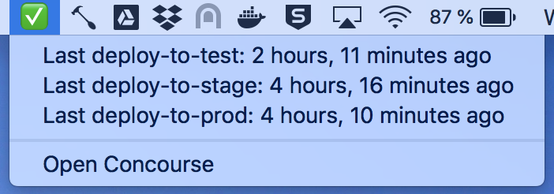

# Hammerspoon Concourse

Puts a menu in your menubar showing how long ago each of your Councourse pipelines successfully ran. Keep your deltas low people.



**Config**

Edit the config object in the lua script:

```lua
local config = {
    flyPath = '~/bin/fly',
    concourseURL = 'https://concourse.example.com',
    target = 'example',
    pipeline = 'my-pipeline',
    jobs = {
        'deploy-to-test',
        'deploy-to-stage',
        'deploy-to-prod'
    }
}
```

Key | Value
------------ | -------------
`flyPath` | The path to your fly executable.
`concourseURL` | The url of your Concourse.
`target` | The target used by fly to connect to your Concourse.
`pipeline` | Which pipelien to monitor.
`jobs` | An array of jobs to show the last deployed state of. Use this to exclude jobs you don't care about.
